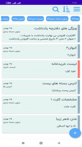
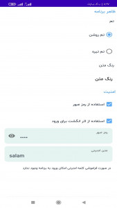
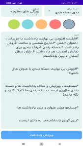

# The Note App 8-)

## Description
This project is an entertaining game for the Android operating system developed using the **Java** programming language and the **Android** development platform.

## Featueres

1. Adding infinite notes with details:
* Title
* Text
* Solar date and time of adding a note
* Categorization
* Color to show the importance of each note
* Has a trash can
* Note pin

2. Add infinite categories with desired titles
   View, edit and delete notes and categories (click and hold on the list of categories)
   Search between title and text of notes

3. Pinning notes to the top of the list

4. Backup and recovery of notes
   Merging notes from two databases with each other

5. Display the list of notes based on the title, text and date in ascending and descending order

6. Share, copy or save as a title text file and note text

7. View the list of notes based on their categories and the number of notes in each category

8. It has a settings section for full control of the program

9. Encrypted to keep notes safe

## installation
to install the app , simply download the apk file from a trusted source and install it on your android device.

## contribution
contributions are welcome. to contribute to the improvement of the app , make suggestions, or report issues, you can open an issue or send a pull request.

## team members
Keyvan Safarzadeh
**KeyvanSafarzadeh1374@gmail.com**

## Task lists
- [x] Create Base App
- [x] Create SQL Database
- [x] Create UI/UX App
- [x] Software logic coding
- [ ] Select multiple notes list items
- [ ] Add TO-DO list
- [ ] Add alarm notes

## Images

| Main Activity| Setting Activity| Add Note Activity|
| :---: |:----:| :----:|
|      |  |  |